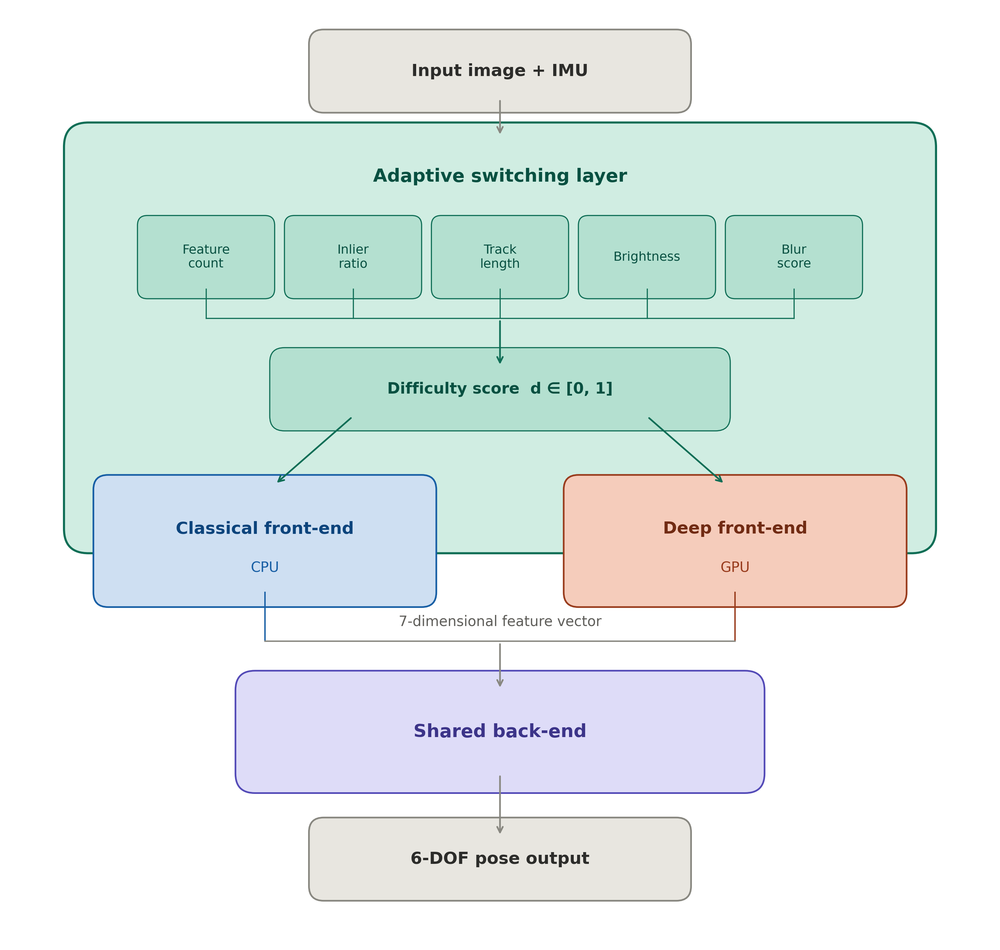

# AdaptiveVINS

**AdaptiveVINS** is a visual-inertial odometry system that combines a classical optical flow front-end with a SuperPoint + LightGlue deep learning front-end. A per-frame difficulty score determines when to augment the classical pipeline with deep feature correspondences, balancing accuracy and computational cost.

Built on [SuperVINS](https://github.com/luohongk/SuperVINS) and [VINS-Fusion](https://github.com/HKUST-Aerial-Robotics/VINS-Fusion). Developed for ROB 530 at the University of Michigan.

---

## System Overview



AdaptiveVINS has three layers:

- **Classical front-end**: FAST corner detection + Lucas-Kanade pyramidal optical flow with bidirectional consistency check. Runs on CPU every frame.
- **Deep front-end**: SuperPoint keypoint detection + LightGlue transformer matcher, deployed via ONNX Runtime with CUDA. Runs selectively based on difficulty.
- **Back-end**: Tightly-coupled sliding-window optimization (Ceres Solver) over poses, velocities, IMU biases, and feature depths. Inherited from VINS-Fusion without modification.

Two branches are available:

| Branch | Behavior |
|---|---|
| `main` | Adaptive: deep front-end fires only when difficulty score exceeds threshold |
| `AugmentedVINS` | Always-on: deep front-end runs every frame post-initialization |

---

## Adaptive Switching

Each frame, a difficulty score $d \in [0,1]$ is computed from five signals:

| Signal | Weight | Description |
|---|---|---|
| Feature count | 0.30 | Fewer tracked features → higher difficulty |
| Inlier ratio | 0.30 | Lower optical flow survival rate → higher difficulty |
| Mean track length | 0.15 | Shorter-lived features → higher difficulty |
| Blur (Laplacian variance) | 0.15 | More blurry → higher difficulty |
| Brightness | 0.10 | Darker image → higher difficulty |

Hysteresis thresholds prevent rapid switching:
- Deep augmentation **ON** when `d > 0.25`
- Deep augmentation **OFF** when `d < 0.12`
- Minimum dwell of 10 frames in each state

When augmentation fires, SuperPoint + LightGlue produces correspondences that are merged into the feature map alongside classical tracks using a fixed ID offset of 1,000,000 to prevent collisions. The shared back-end processes both sets identically.

---

## Dependencies

- Ubuntu 20.04, ROS Noetic
- OpenCV 4.2: `sudo apt-get install libopencv-dev`
- [Ceres Solver 2.1.0](https://github.com/ceres-solver/ceres-solver/releases/tag/2.1.0)
- [ONNX Runtime 1.16.3 (GPU)](https://github.com/microsoft/onnxruntime/releases/download/v1.16.3/onnxruntime-linux-x64-gpu-1.16.3.tgz)
- CUDA-capable GPU

---

## Build

```bash
mkdir -p ~/catkin_ws/src
cd ~/catkin_ws/src
git clone https://github.com/alexanderbowler/AdaptiveVINS.git AdaptiveVINS
cd ~/catkin_ws
catkin_make --pkg adaptivevins
```

Update the ONNX Runtime and Ceres paths in `adaptivevins_estimator/CMakeLists.txt` before building:

```cmake
set(ONNXRUNTIME_ROOTDIR "/path/to/onnxruntime")
find_package(Ceres REQUIRED PATHS "/path/to/ceres")
```

---

## Run

```bash
# Terminal 1 — estimator
rosrun adaptivevins adaptivevins_node \
    ~/catkin_ws/src/AdaptiveVINS/config/euroc/euroc_mono_imu_config.yaml

# Terminal 2 — bag
rosbag play /path/to/euroc_bag.bag
```

---

## Evaluation

Benchmark scripts are in `dev/`:

```bash
# Single bag, 5 good runs target
./dev/run_rmse_benchmark.sh --model adaptivevinsV4 --bag V1_01_easy

# Full EuRoC sweep across all models and bags
./dev/run_full_sweep.sh --models "adaptivevinsV4 vinsfusion supervins"

# Print ATE and timing tables from results
python3 dev/print_results_table.py
python3 dev/print_results_table.py --ate-metric mean
```

Results are written to `~/results/<bag>-<model>-rmse/`.

---

## Acknowledgements

- [SuperVINS](https://github.com/luohongk/SuperVINS) — Hongkun Luo et al., IEEE Sensors Journal 2025
- [VINS-Fusion](https://github.com/HKUST-Aerial-Robotics/VINS-Fusion) — HKUST Aerial Robotics Group
- [SuperPoint](https://github.com/magicleap/SuperPointPretrainedNetwork) — Magic Leap
- [LightGlue-OnnxRunner](https://github.com/OroChippw/LightGlue-OnnxRunner)
- [DBoW3](https://github.com/rmsalinas/DBow3)
